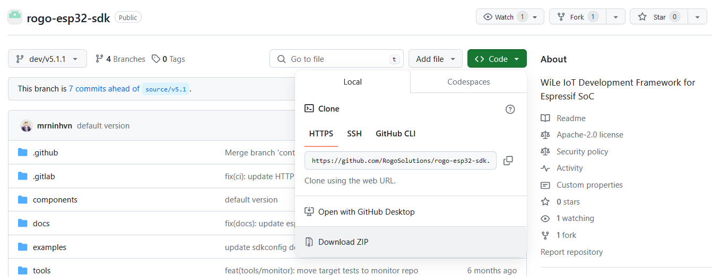
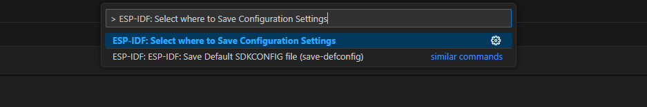
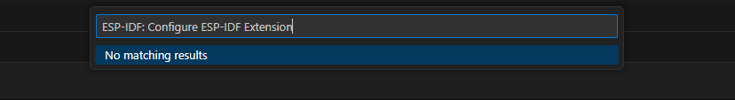
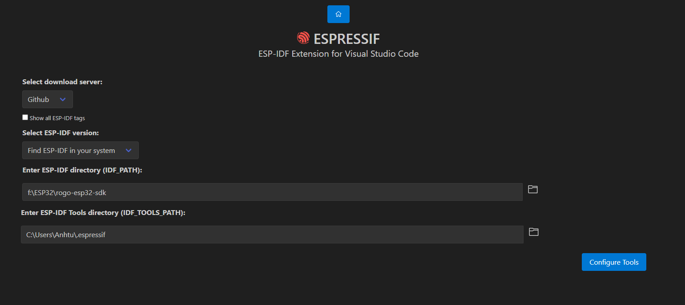
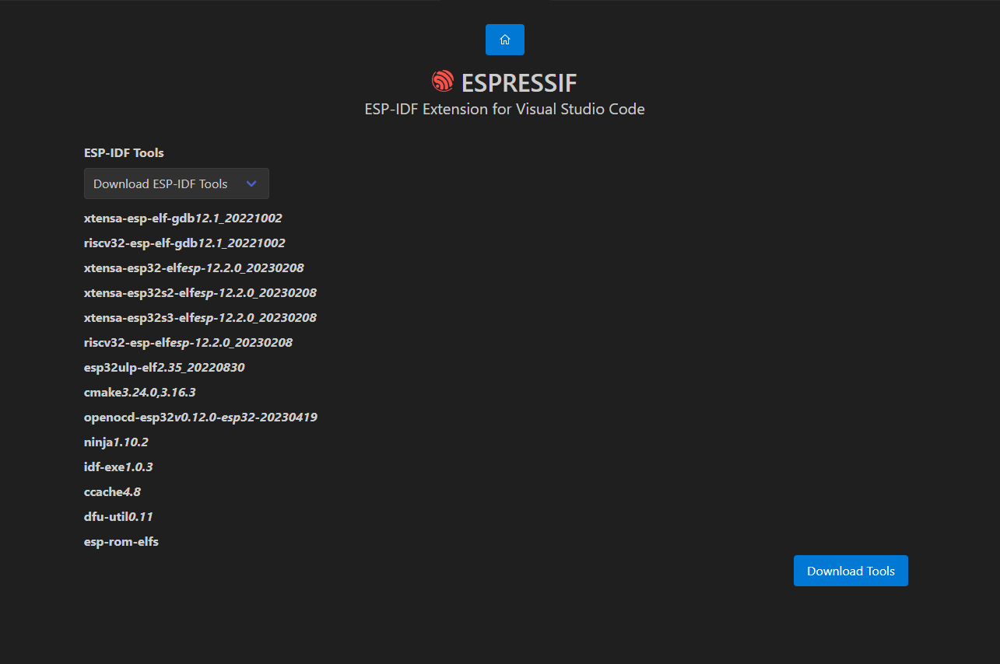

# Installation with VScode extension on Windows

## Step 1 Download ROGO_ESP32_WILE_SDK

 you can also directly download from the [ROGO_ESP32_WILE_SDK's github page](https://github.com/RogoSolutions/rogo-esp32-sdk/tree/dev/v5.1.1)

<p>
  
</p>

**Alternatively** if you have install **git** or **Github Desktop**, you can clone the repo with branch **dev/v5.1.1** in the following link:
```
https://github.com/RogoSolutions/rogo-esp32-sdk.git
```
Please 
## Step 2 Install VScode extension and ROGO_ESP32_WILE_SDK
Download and install [Visual Studio Code](https://code.visualstudio.com/).

Open the **Extensions** view by clicking on the Extension icon in the Activity Bar on the side of Visual Studio Code or the **View: Extensions** command (shortcut: <kbd>Ctrl+Shift+X</kbd>).
<p>
  
</p>

Search for [ESP-IDF Extension](https://marketplace.visualstudio.com/items?itemName=espressif.esp-idf-extension), and install it.

<p>
  
</p>

**(OPTIONAL)** Press <kbd>F1</kbd> and type **ESP-IDF: Select where to Save Configuration Settings**, which can be User Settings, Workspace Settings or Workspace Folder Settings. Please take a look at [Working with multiple projects](https://github.com/espressif/vscode-esp-idf-extension/blob/master/docs/MULTI_PROJECTS.md) for more information. Default is User settings.


<p>
  
</p>

In Visual Studio Code, Press <kbd>F1</kbd> or select menu "View" and "Command Palette" and type [configure esp-idf extension]. After, choose the **ESP-IDF: Configure ESP-IDF Extension** option. You can also choose where to save settings in the setup wizard.
<p>
  
</p>


Now the setup wizard window will be shown with several setup options: **Express**, **Advanced** or **Use Existing Setup**.

<p>
  
</p>


Choose **Advanced** option, after ESP-IDF is downloaded and extracted, select to either download ESP-IDF Tools or manually provide each ESP-IDF tool absolute path and required environment variables.
    > **NOTE:** Consider that `IDF_PATH` requires each ESP-IDF tool to be of the version described in `IDF_PATH`/tools/tools.json.
    > If it is desired to use a different ESP-IDF tool version, check [JSON Manual Configuration](https://github.com/espressif/vscode-esp-idf-extension/blob/master/docs/SETUP.md#JSON-Manual-Configuration)

<p>
  
</p>

Next step, the user will be asked how to install the ESP_IDF tools, the user can just leave the default option of **Download ESP-IDF tools**
<p>
  
</p>

Otherwise, if the user already installed the ESP-IDF tools, and want to use them , they can select  **Use existing ESP-IDF tools** and provide the absolute path, please enter the executable container directory for each binary as shown below:
    > **NOTE:** Check [JSON Manual Configuration](https://github.com/espressif/vscode-esp-idf-extension/blob/master/docs/SETUP.md#JSON-Manual-Configuration) for more information.

<p>
  
</p>

If everything is installed **correctly**, the user will see a message that all settings have been configured. You can start using the extension.

<p>
  
</p>

> **NOTE**: The advance mode allows the user to choose to use existing ESP-IDF tools by manually entering each ESP-IDF tool absolute path. Make sure each ESP-IDF tool path doesn't have any spaces.

Now that the extension setup is finally done, check the [Basic use](./basic_use.md) to learn how to use the SDK Configuration editor, build, flash and monitor your Espressif device.

> **NOTE**: Visual Studio Code has many places where to set configuration settings. This extension uses the `idf.saveScope` configuration setting to determine where to save settings, Global (User Settings), Workspace and WorkspaceFolder. Please review [vscode settings precedence](https://code.visualstudio.com/docs/getstarted/settings#_settings-precedence).

> **NOTE:** the setup wizard will install ESP-IDF Python packages and ESP-IDF debug adapter (`EXTENSION_PATH`/esp_debug_adapter/requirements.txt) python packages. Make sure that if using an existing python virtual environment that installing these packages doesn't affect your virtual environment. The `EXTENSION_PATH` is: `%USERPROFILE%\.vscode\extensions\espressif.esp-idf-extension-VERSION`

<!-- # Installing Nightly Build

To install the nightly build follow the instructions below.

Nightly builds are available for <a href="https://nightly.link/espressif/vscode-esp-idf-extension/workflows/ci/master/esp-idf-extension.vsix.zip">Visual Studio Code</a> or <a href="https://nightly.link/espressif/vscode-esp-idf-extension/workflows/ci/master/esp-idf-extension-open.vsix.zip">OpenVSX</a>.

- Open VS Code
- Go to Extensions
- Click on the `...` from the top and choose `Install from VSIX...`
- Browse to the VSIX file you downloaded
- Wait for the extension to install
- Click the Reload button on the VS Code notification that appears -->


> **NOTE:** [Troubleshooting](https://github.com/espressif/vscode-esp-idf-extension/blob/master/README.md#Troubleshooting)
