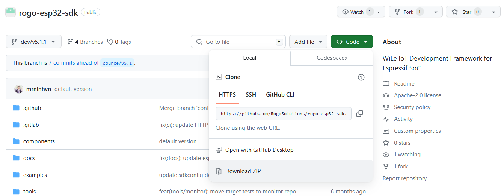
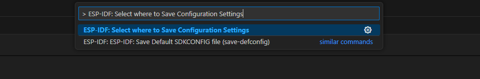
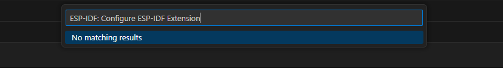
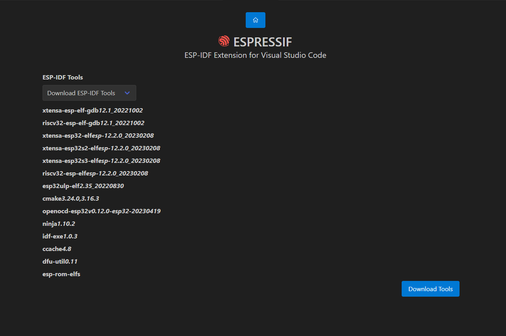

# Installation with VScode extension on MacOS/Linux


## Step 1. Install Prerequisites
```{eval-rst}

In order to use ROGO_ESP32_WILE_SDK with the WILE ESP32 device, you need to install some software packages based on your Operating System. This setup guide helps you on getting everything installed on Linux and macOS based systems.

For Linux Users
~~~~~~~~~~~~~~~

To compile using ROGO_ESP32_WILE_SDK, you need to get the following packages. The command to run depends on which distribution of Linux you are using:

- Ubuntu and Debian::

    sudo apt-get install git wget flex bison gperf python3 python3-pip python3-venv cmake ninja-build ccache libffi-dev libssl-dev dfu-util libusb-1.0-0

- CentOS 7 & 8::

    sudo yum -y update && sudo yum install git wget flex bison gperf python3 cmake ninja-build ccache dfu-util libusbx

CentOS 7 is still supported but CentOS version 8 is recommended for a better user experience.

- Arch::

    sudo pacman -S --needed gcc git make flex bison gperf python cmake ninja ccache dfu-util libusb

.. note::
    - CMake version 3.16 or newer is required for use with ROGO_ESP32_WILE_SDK. Run "tools/idf_tools.py install cmake" to install a suitable version if your OS versions does not have one.
    - If you do not see your Linux distribution in the above list then please check its documentation to find out which command to use for package installation.

For macOS Users
~~~~~~~~~~~~~~~

ROGO_ESP32_WILE_SDK uses the version of Python installed by default on macOS.

- Install CMake & Ninja build:

  - If you have HomeBrew_, you can run::

      brew install cmake ninja dfu-util

  - If you have MacPorts_, you can run::

      sudo port install cmake ninja dfu-util

  - Otherwise, consult the CMake_ and Ninja_ home pages for macOS installation downloads.

- It is strongly recommended to also install ccache_ for faster builds. If you have HomeBrew_, this can be done via ``brew install ccache`` or ``sudo port install ccache`` on MacPorts_.

.. note::
   If an error like this is shown during any step::

     xcrun: error: invalid active developer path (/Library/Developer/CommandLineTools), missing xcrun at: /Library/Developer/CommandLineTools/usr/bin/xcrun

   Then you need to install the XCode command line tools to continue. You can install these by running ``xcode-select --install``.

Apple M1 Users
~~~~~~~~~~~~~~

If you use Apple M1 platform and see an error like this::

      WARNING: directory for tool xtensa-esp32-elf version esp-2021r2-patch3-8.4.0 is present, but tool was not found
      ERROR: tool xtensa-esp32-elf has no installed versions. Please run 'install.sh' to install it.

or::

      zsh: bad CPU type in executable: ~/.espressif/tools/xtensa-esp32-elf/esp-2021r2-patch3-8.4.0/xtensa-esp32-elf/bin/xtensa-esp32-elf-gcc

Then you need to install Apple Rosetta 2 by running

.. code-block:: bash

    /usr/sbin/softwareupdate --install-rosetta --agree-to-license


Installing Python 3
~~~~~~~~~~~~~~~~~~~

Based on macOS `Catalina 10.15 release notes`_, use of Python 2.7 is not recommended and Python 2.7 is not included by default in future versions of macOS. Check what Python you currently have::

  python --version

If the output is like ``Python 2.7.17``, your default interpreter is Python 2.7. If so, also check if Python 3 is not already installed on your computer::

  python3 --version

If the above command returns an error, it means Python 3 is not installed.

Below is an overview of the steps to install Python 3.

  - Installing with HomeBrew_ can be done as follows::

      brew install python3

  - If you have MacPorts_, you can run::

      sudo port install python38

.. _get-started-get-esp-idf:
```
## Step 2 Download ROGO_ESP32_WILE_SDK

To get ROGO_ESP32_WILE_SDK, navigate to your installation directory and clone the repository with ``git clone``, following instructions below specific to your operating system.

Open Terminal, and run the following commands:

.. code-block:: bash
    
    mkdir -p ~/esp
    cd ~/esp
    git clone -b dev/v5.1.1 --recursive https://github.com/RogoSolutions/rogo-esp32-sdk.git

ROGO_ESP32_WILE_SDK is downloaded into ``~/esp/rogo-esp32-sdk``.

**Alternatively** you can also directly download from the [ROGO_ESP32_WILE_SDK's github page](https://github.com/RogoSolutions/rogo-esp32-sdk/tree/dev/v5.1.1)

<p>
  
</p>

## Step 3 Install VScode extension and ROGO_ESP32_WILE_SDK
Download and install [Visual Studio Code](https://code.visualstudio.com/).

Open the **Extensions** view by clicking on the Extension icon in the Activity Bar on the side of Visual Studio Code or the **View: Extensions** command (shortcut: <kbd>⇧</kbd> <kbd>⌘</kbd> <kbd>X</kbd> or <kbd>Ctrl+Shift+X</kbd>.
<p>
  
</p>

Search for [ESP-IDF Extension](https://marketplace.visualstudio.com/items?itemName=espressif.esp-idf-extension), and install it.

<p>
  
</p>

**(OPTIONAL)** Press <kbd>F1</kbd> and type **ESP-IDF: Select where to Save Configuration Settings**, which can be User Settings, Workspace Settings or Workspace Folder Settings. Please take a look at [Working with multiple projects](https://github.com/espressif/vscode-esp-idf-extension/blob/master/docs/MULTI_PROJECTS.md) for more information. Default is User settings.


<p>
  
</p>

In Visual Studio Code, Press <kbd>F1</kbd> or select menu "View" and "Command Palette" and type [configure esp-idf extension]. After, choose the **ESP-IDF: Configure ESP-IDF Extension** option. You can also choose where to save settings in the setup wizard.
<p>
  
</p>


Now the setup wizard window will be shown with several setup options: **Express**, **Advanced** or **Use Existing Setup**.

<!-- > **NOTE**: **Use Existing Setup** setup mode option is only shown if:
>
> - `esp-idf.json` is found in the current `idf.toolsPath` (MacOS/Linux users) or `idf.toolsPathWin` (Windows users). This file is generated when you install ESP-IDF with the [ESP-IDF Windows Installer](https://github.com/espressif/idf-installer) or using [IDF-ENV](https://github.com/espressif/idf-env).
> - ESP-IDF is found in `idf.espIdfPath` or `idf.espIdfPathWin`, `IDF_PATH` environment variable, `$HOME/esp/esp-idf` on MacOS/Linux and `%USERPROFILE%\esp\esp-idf` or `%USERPROFILE%\Desktop\esp-idf` in Windows.
> - ESP-IDF Tools and ESP-IDF Python virtual environment for the previous ESP-IDF are found in `idf.toolsPath` or`idf.toolsPathWin`, `IDF_TOOLS_PATH` environment variable, `$HOME\.espressif` on MacOS/Linux and `%USERPROFILE%\.espressif` on Windows. -->

<p>
  
</p>

<!-- Choose **Express** for the fastest option (or **Use Existing Setup** if ESP-IDF is already installed)
If you choose **Express** setup mode:
  - Pick an ESP-IDF version to download (or find ESP-IDF in your system) and the python executable to create the virtual environment.
  - Choose the location for ESP-IDF Tools and python virtual environment (also known as `IDF_TOOLS_PATH`) which is `$HOME\.espressif` on MacOS/Linux and `%USERPROFILE%\.espressif` on Windows by default.
    > **NOTE:** Windows users don't need to select a python executable since it is part of the setup. -->
<!-- (or **Use Existing Setup** if ESP-IDF is already installed) -->
<!-- Choose **Advanced** option  -->
<!-- <p>
  
</p>

If you choose **Express** setup mode:
> **NOTE:** Make sure that `IDF_PATH` and `IDF_TOOLS_PATH` doesn't have any spaces to avoid any build issues.

<p>
  
</p>

The user will see a page showing the setup progress status showing ESP-IDF download progress, ESP-IDF Tools download and install progress as well as the creation of a python virtual environment.

<p>
  
</p> -->

Choose **Advanced** option, after ESP-IDF is downloaded and extracted, select to either download ESP-IDF Tools or manually provide each ESP-IDF tool absolute path and required environment variables.
    > **NOTE:** Consider that `IDF_PATH` requires each ESP-IDF tool to be of the version described in `IDF_PATH`/tools/tools.json.
    > If it is desired to use a different ESP-IDF tool version, check [JSON Manual Configuration](https://github.com/espressif/vscode-esp-idf-extension/blob/master/docs/SETUP.md#JSON-Manual-Configuration)

<p>
  
</p>

Next step, the user will be asked how to install the ESP_IDF tools, the user can just leave the default option of **Download ESP-IDF tools**
<p>
  
</p>

Otherwise, if the user already installed the ESP-IDF tools, and want to use them , they can select  **Use existing ESP-IDF tools** and provide the absolute path, please enter the executable container directory for each binary as shown below:
    > **NOTE:** Check [JSON Manual Configuration](https://github.com/espressif/vscode-esp-idf-extension/blob/master/docs/SETUP.md#JSON-Manual-Configuration) for more information.

<p>
  
</p>

If everything is installed **correctly**, the user will see a message that all settings have been configured. You can start using the extension.

<p>
  
</p>

> **NOTE**: The advance mode allows the user to choose to use existing ESP-IDF tools by manually entering each ESP-IDF tool absolute path. Make sure each ESP-IDF tool path doesn't have any spaces.

Now that the extension setup is finally done, check the [Basic use](./basic_use.md) to learn how to use the SDK Configuration editor, build, flash and monitor your Espressif device.

> **NOTE**: Visual Studio Code has many places where to set configuration settings. This extension uses the `idf.saveScope` configuration setting to determine where to save settings, Global (User Settings), Workspace and WorkspaceFolder. Please review [vscode settings precedence](https://code.visualstudio.com/docs/getstarted/settings#_settings-precedence).

> **NOTE:** the setup wizard will install ESP-IDF Python packages and ESP-IDF debug adapter (`EXTENSION_PATH`/esp_debug_adapter/requirements.txt) python packages. Make sure that if using an existing python virtual environment that installing these packages doesn't affect your virtual environment. The `EXTENSION_PATH` is: `$HOME/.vscode/extensions/espressif.esp-idf-extension-VERSION`

<!-- # Installing Nightly Build

To install the nightly build follow the instructions below.

Nightly builds are available for <a href="https://nightly.link/espressif/vscode-esp-idf-extension/workflows/ci/master/esp-idf-extension.vsix.zip">Visual Studio Code</a> or <a href="https://nightly.link/espressif/vscode-esp-idf-extension/workflows/ci/master/esp-idf-extension-open.vsix.zip">OpenVSX</a>.

- Open VS Code
- Go to Extensions
- Click on the `...` from the top and choose `Install from VSIX...`
- Browse to the VSIX file you downloaded
- Wait for the extension to install
- Click the Reload button on the VS Code notification that appears
 -->

> **NOTE:** [Troubleshooting](https://github.com/espressif/vscode-esp-idf-extension/blob/master/README.md#Troubleshooting)
```{eval-rst}
.. include:: vscode_linux-macos-start-project.rst
.. include:: vscode_start_project.rst

```
