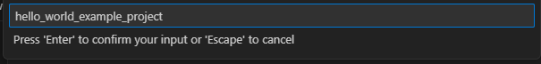
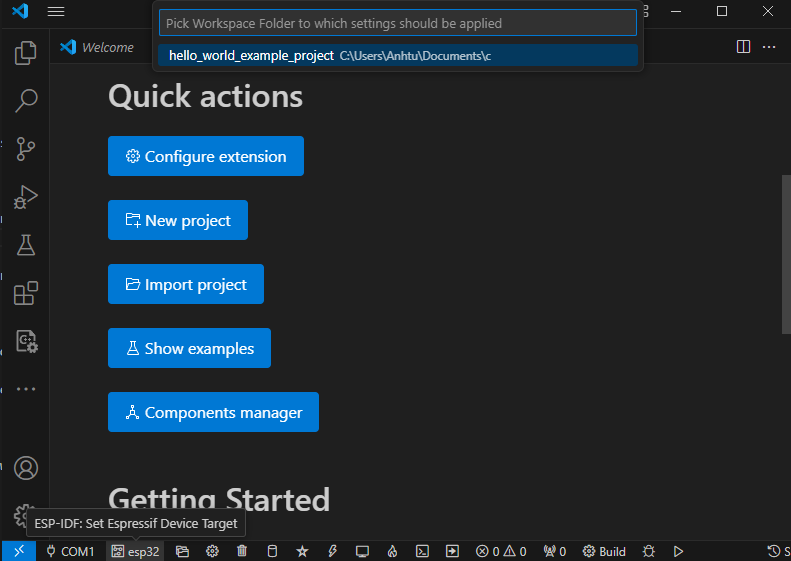

Now since all requirements are met, the next topic will guide you on how to start your first project.

This guide helps you on the first steps using ESP-IDF. Follow this guide to start a new project on the |IDF_TARGET_NAME| and build, flash, and monitor the device output.

.. note::

    If you have not yet installed ESP-IDF, please go to :ref:`get-started-step-by-step` and follow the instruction in order to get all the software needed to use this guide.

Start a Project
===============

Now you are ready to prepare your application for |IDF_TARGET_NAME|. You can start with :example:`get-started/hello_world` project from :idf:`examples` directory in ESP-IDF.
```{eval-rst}
.. important::

    The ESP-IDF build system does not support spaces in the paths to either ESP-IDF or to projects.


```

.. code-block:: bash

    cd [Path to SDK]/esp
    cp -r $IDF_PATH/examples/get-started/hello_world .

.. note:: There is a range of example projects in the :idf:`examples` directory in ESP-IDF. You can copy any project in the same way as presented above and run it. It is also possible to build examples in-place without copying them first.


Open VScode, click on Espressif logo on the left panel, you will be greeted with a windows like this:

.. figure:: ../doc/picture/vsc_st_0.png
    :align: center
    :alt: IDF extension - Homepage

    IDF extension - Homepage

Click on **import project** , a prompt windows will show up, navigate to `[Path to SDK]/examples/get-started/hello_world` and select the desired example, which is `hello_world`:

.. figure:: ../doc/picture/vsc_st_00.png
    :align: center
    :alt: Choosing example folder 

    Choosing example folder 

Then choose the location where you want to save/copy the example project to:

.. figure:: ../doc/picture/vsc_st_01.png
    :align: center
    :alt: Prompt to select folder 

    Prompt to select folder 

Then put in your project name.



    Project configuration - WILE device - Factory board test

After that open the project folder you just created.

.. figure:: ../doc/picture/vsc_st_03.png
    :align: center
    :alt: Project configuration - WILE device - Factory board test

    Project configuration - WILE device - Factory board test
    
.. figure:: ../doc/picture/vsc_st_04.png
    :align: center
    :alt: Project configuration - WILE device - Factory board test

    Project configuration - WILE device - Factory board test


Connect Your Device
===================

Now connect your |IDF_TARGET_NAME| board to the computer and check under which serial port the board is visible.

Serial ports have the following naming patterns:

- **Linux**: starting with ``/dev/tty``
- **macOS**: starting with ``/dev/cu.``
- **macOS**: starting with ``COM``
If you are not sure how to check the serial port name, please refer to :doc:`establish-serial-connection` for full details.

You can also see which serial ports are currently available by click on the serial port icon (🔌) at the tool bar of IDF extension, and choose your device serial port here

.. figure:: ../doc/picture/vsc_st_05.png
    :align: center
    :alt: Serial Port listing and selection

    Serial Port listing and selection

.. note::

    Keep the port name handy as it is needed in the next steps.

Configure Your Project
======================
After opening a new project, you should first set the target with correspond to the hardware or chip module you are using .Note that existing builds and configurations in the project, if any, are cleared and initialized in this process. The target may be saved in the environment variable to skip this step at all. See :ref:`selecting-idf-target` for additional information.

Click on the **`Set Espressif device target`** icon, to select the correct ESP32 series you are using.



    Set target device for the project

Click on the **`SDK Configuration`** icon (⚙) on the tool bar to run the configuration, and the menuconfig should show up like this

.. figure:: ../doc/picture/vsc_st_06.png
    :align: center
    :alt: SDK Configuration (Menuconfig - GUI version)

    SDK Configuration (Menuconfig - GUI version)


.. If the previous steps have been done correctly, the following menu appears:

.. .. figure:: ../doc/picture/menuconfig.png
..     :align: center
..     :alt: Project configuration - Home window

..     Project configuration - Home window

You are using this menu to set up project specific variables, e.g., Wi-Fi network name and password, the processor speed, etc. Setting up the project with menuconfig may be skipped for "hello_world", since this example runs with default configuration.

.. note::

    The colors of the menu could be different in your terminal. You can change the appearance with the option ``--style``. Please run ``idf.py menuconfig --help`` for further information.


.. |IDF_TARGET_NAME| replace:: WILE ESP32 device