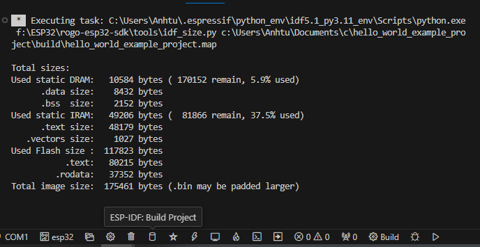

Build the Project
=================

Build the project by clicking **build icon** :

.. figure:: ../doc/picture/vsc_st_08.png
    :align: center
    :alt: Build project

    Build project

This compiles the application and all ESP-IDF components, then it generates the bootloader, partition table, and application binaries.

.. .. code-block:: none

..     $ idf.py build
..     Running cmake in directory /path/to/hello_world/build
..     Executing "cmake -G Ninja --warn-uninitialized /path/to/hello_world"...
..     Warn about uninitialized values.
..     -- Found Git: /usr/bin/git (found version "2.17.0")
..     -- Building empty aws_iot component due to configuration
..     -- Component names: ...
..     -- Component paths: ...

..     ... (more lines of build system output)

..     [527/527] Generating hello_world.bin
..     esptool.py v2.3.1

..     Project build complete. To flash, run this command:
..     ../../../components/esptool_py/esptool/esptool.py -p (PORT) -b 921600 write_flash --flash_mode dio --flash_size detect --flash_freq 40m 0x10000 build/hello_world.bin  build 0x1000 build/bootloader/bootloader.bin 0x8000 build/partition_table/partition-table.bin
..     or run 'idf.py -p PORT flash'

If there are no errors, the build finishes by generating the firmware binary .bin files with output like this.

    Build result
    

Flash onto the Device
=====================

To flash the binaries that you just built for the |IDF_TARGET_NAME| in the previous step, you need to run the following command:

.. code-block:: bash

    idf.py -p PORT flash

Replace ``PORT`` with your |IDF_TARGET_NAME| board's USB port name. If the ``PORT`` is not defined, the :ref:`idf.py` will try to connect automatically using the available USB ports.

For more information on ``idf.py`` arguments, see :ref:`idf.py`.

.. note::

    The option ``flash`` automatically builds and flashes the project, so running ``idf.py build`` is not necessary.

Encountered Issues While Flashing? See the "Additional Tips" below. You can also refer to :doc:`flashing-troubleshooting` page or :doc:`establish-serial-connection` for more detailed information.

Normal Operation
~~~~~~~~~~~~~~~~

When flashing, you will see the output log similar to the following:

    .. code-block:: none

        ...
        esptool.py --chip esp32c3 -p /dev/ttyUSB0 -b 460800 --before=default_reset --after=hard_reset write_flash --flash_mode dio --flash_freq 80m --flash_size 2MB 0x8000 partition_table/partition-table.bin 0x0 bootloader/bootloader.bin 0x10000 hello_world.bin
        esptool.py v3.0
        Serial port /dev/ttyUSB0
        Connecting....
        Chip is ESP32-C3
        Features: Wi-Fi
        Crystal is 40MHz
        MAC: 7c:df:a1:40:02:a4
        Uploading stub...
        Running stub...
        Stub running...
        Changing baud rate to 460800
        Changed.
        Configuring flash size...
        Compressed 3072 bytes to 103...
        Writing at 0x00008000... (100 %)
        Wrote 3072 bytes (103 compressed) at 0x00008000 in 0.0 seconds (effective 4238.1 kbit/s)...
        Hash of data verified.
        Compressed 18960 bytes to 11311...
        Writing at 0x00000000... (100 %)
        Wrote 18960 bytes (11311 compressed) at 0x00000000 in 0.3 seconds (effective 584.9 kbit/s)...
        Hash of data verified.
        Compressed 145520 bytes to 71984...
        Writing at 0x00010000... (20 %)
        Writing at 0x00014000... (40 %)
        Writing at 0x00018000... (60 %)
        Writing at 0x0001c000... (80 %)
        Writing at 0x00020000... (100 %)
        Wrote 145520 bytes (71984 compressed) at 0x00010000 in 2.3 seconds (effective 504.4 kbit/s)...
        Hash of data verified.

        Leaving...
        Hard resetting via RTS pin...
        Done

.. .. only:: esp32c6

..     .. code-block:: none

..         ...
..         esptool esp32c6 -p /dev/ttyUSB0 -b 460800 --before=default_reset --after=hard_reset --no-stub write_flash --flash_mode dio --flash_freq 80m --flash_size 2MB 0x0 bootloader/bootloader.bin 0x10000 hello_world.bin 0x8000 partition_table/partition-table.bin
..         esptool.py v4.3
..         Serial port /dev/ttyUSB0
..         Connecting....
..         Chip is ESP32-C6 (revision v0.0)
..         Features: WiFi 6, BT 5
..         Crystal is 40MHz
..         MAC: 60:55:f9:f6:01:38
..         Changing baud rate to 460800
..         Changed.
..         Enabling default SPI flash mode...
..         Configuring flash size...
..         Flash will be erased from 0x00000000 to 0x00004fff...
..         Flash will be erased from 0x00010000 to 0x00028fff...
..         Flash will be erased from 0x00008000 to 0x00008fff...
..         Erasing flash...
..         Took 0.17s to erase flash block
..         Writing at 0x00000000... (5 %)
..         Writing at 0x00000c00... (23 %)
..         Writing at 0x00001c00... (47 %)
..         Writing at 0x00003000... (76 %)
..         Writing at 0x00004000... (100 %)
..         Wrote 17408 bytes at 0x00000000 in 0.5 seconds (254.6 kbit/s)...
..         Hash of data verified.
..         Erasing flash...
..         Took 0.85s to erase flash block
..         Writing at 0x00010000... (1 %)
..         Writing at 0x00014c00... (20 %)
..         Writing at 0x00019c00... (40 %)
..         Writing at 0x0001ec00... (60 %)
..         Writing at 0x00023c00... (80 %)
..         Writing at 0x00028c00... (100 %)
..         Wrote 102400 bytes at 0x00010000 in 3.2 seconds (253.5 kbit/s)...
..         Hash of data verified.
..         Erasing flash...
..         Took 0.04s to erase flash block
..         Writing at 0x00008000... (33 %)
..         Writing at 0x00008400... (66 %)
..         Writing at 0x00008800... (100 %)
..         Wrote 3072 bytes at 0x00008000 in 0.1 seconds (269.0 kbit/s)...
..         Hash of data verified.

..         Leaving...
..         Hard resetting via RTS pin...

.. .. only:: esp32h2

..     .. code-block:: none

..         ...
..         esptool esp32h2 -p /dev/ttyUSB0 -b 460800 --before=default_reset --after=hard_reset write_flash --flash_mode dio --flash_freq 48m --flash_size 2MB 0x0 bootloader/bootloader.bin 0x10000 hello_world.bin 0x8000 partition_table/partition-table.bin
..         esptool.py v4.6
..         Serial port /dev/ttyUSB0
..         Connecting....
..         Chip is ESP32-H2 (revision v0.1)
..         Features: BLE
..         Crystal is 32MHz
..         MAC: 60:55:f9:f7:3e:93:ff:fe
..         Uploading stub...
..         Running stub...
..         Stub running...
..         Changing baud rate to 460800
..         Changed.
..         Configuring flash size...
..         Flash will be erased from 0x00000000 to 0x00005fff...
..         Flash will be erased from 0x00010000 to 0x00034fff...
..         Flash will be erased from 0x00008000 to 0x00008fff...
..         Compressed 20880 bytes to 12788...
..         Writing at 0x00000000... (100 %)
..         Wrote 20880 bytes (12788 compressed) at 0x00000000 in 0.6 seconds (effective 297.5 kbit/s)...
..         Hash of data verified.
..         Compressed 149424 bytes to 79574...
..         Writing at 0x00010000... (20 %)
..         Writing at 0x00019959... (40 %)
..         Writing at 0x00020bb5... (60 %)
..         Writing at 0x00026d8f... (80 %)
..         Writing at 0x0002e60a... (100 %)
..         Wrote 149424 bytes (79574 compressed) at 0x00010000 in 2.1 seconds (effective 571.7 kbit/s)...
..         Hash of data verified.
..         Compressed 3072 bytes to 103...
..         Writing at 0x00008000... (100 %)
..         Wrote 3072 bytes (103 compressed) at 0x00008000 in 0.0 seconds (effective 539.7 kbit/s)...
..         Hash of data verified.

..         Leaving...
..         Hard resetting via RTS pin...

If there are no issues by the end of the flash process, the board will reboot and start up the "hello_world" application.

If you would like to use the Eclipse or VS Code IDE instead of running ``idf.py``, check out `Eclipse Plugin <https://github.com/espressif/idf-eclipse-plugin/blob/master/README.md>`_, `VSCode Extension <https://github.com/espressif/vscode-esp-idf-extension/blob/master/docs/tutorial/install.md>`_.

Monitor the Output
==================

To check if "hello_world" is indeed running, type ``idf.py -p PORT monitor`` (Do not forget to replace PORT with your serial port name).

This command launches the :doc:`IDF Monitor <../api-guides/tools/idf-monitor>` application::

    $ idf.py -p <PORT> monitor
    Running idf_monitor in directory [...]/esp/hello_world/build
    Executing "python [...]/esp-idf/tools/idf_monitor.py -b 115200 [...]/esp/hello_world/build/hello_world.elf"...
    --- idf_monitor on <PORT> 115200 ---
    --- Quit: Ctrl+] | Menu: Ctrl+T | Help: Ctrl+T followed by Ctrl+H ---
    ets Jun  8 2016 00:22:57

    rst:0x1 (POWERON_RESET),boot:0x13 (SPI_FAST_FLASH_BOOT)
    ets Jun  8 2016 00:22:57
    ...

After startup and diagnostic logs scroll up, you should see "Hello world!" printed out by the application.

.. code-block:: none

        ...
        Hello world!
        Restarting in 10 seconds...
        This is {IDF_TARGET_PATH_NAME} chip with {IDF_TARGET_SOC_CPU_CORES_NUM} CPU core(s), {IDF_TARGET_FEATURES}
    Minimum free heap size: {IDF_TARGET_HEAP_SIZE} bytes
        Restarting in 9 seconds...
        Restarting in 8 seconds...
        Restarting in 7 seconds...

To exit IDF monitor use the shortcut ``Ctrl+]``.

.. .. only:: esp32 or esp32c2

..     If IDF monitor fails shortly after the upload, or, if instead of the messages above, you see random garbage similar to what is given below, your board is likely using a 26 MHz crystal. Most development board designs use 40 MHz, so ESP-IDF uses this frequency as a default value.

..     .. figure:: ../../_static/get-started-garbled-output.png
..         :align: center
..         :alt: Garbled output
..         :figclass: align-center

..     If you have such a problem, do the following:

..     1. Exit the monitor.
..     2. Go back to ``menuconfig``.
..     3. Go to ``Component config`` --> ``Hardware Settings`` --> ``Main XTAL Config`` --> ``Main XTAL frequency``, then change :ref:`CONFIG_XTAL_FREQ_SEL` to 26 MHz.
..     4. After that, ``build and flash`` the application again.

..     In the current version of ESP-IDF, main XTAL frequencies supported by |IDF_TARGET_NAME| are as follows:

..     .. list::

..         :SOC_XTAL_SUPPORT_24M: - 24 MHz
..         :SOC_XTAL_SUPPORT_26M: - 26 MHz
..         :SOC_XTAL_SUPPORT_32M: - 32 MHz
..         :SOC_XTAL_SUPPORT_40M: - 40 MHz

.. note::

    You can combine building, flashing and monitoring into one step by running::

        idf.py -p PORT flash monitor

See also:

- :doc:`IDF Monitor <../api-guides/tools/idf-monitor>` for handy shortcuts and more details on using IDF monitor.
- :ref:`idf.py` for a full reference of ``idf.py`` commands and options.

**That is all that you need to get started with |IDF_TARGET_NAME| !**

Now you are ready to try some other :idf:`examples`, or go straight to developing your own applications.

.. important::

    Some of examples do not support |IDF_TARGET_NAME| because required hardware is not included in |IDF_TARGET_NAME| so it cannot be supported.

    If building an example, please check the README file for the ``Supported Targets`` table. If this is present including |IDF_TARGET_NAME| target, or the table does not exist at all, the example will work on |IDF_TARGET_NAME|.

Additional Tips
===============

Permission Denied Issue
~~~~~~~~~~~~~~~~~~~~~~~~

With some Linux distributions, you may get the error message similar to ``Could not open port <PORT>: Permission denied: '<PORT>'`` when flashing the |IDF_TARGET_NAME|. :ref:`This can be solved by adding the current user to the specific group <linux-dialout-group>`, such as ``dialout`` or ``uucp`` group.

Python Compatibility
~~~~~~~~~~~~~~~~~~~~

ESP-IDF supports Python 3.8 or newer. It is recommended to upgrade your operating system to a recent version satisfying this requirement. Other options include the installation of Python from `sources <https://www.python.org/downloads/>`_ or the use of a Python version management system such as `pyenv <https://github.com/pyenv/pyenv>`_.

.. only:: esp32 or esp32s2 or esp32s3

    ..
        When adding new targets to the line above, please update this list in windows-start-project.rst and linux-macos-start-project.rst

    Start with Board Support Package
    ~~~~~~~~~~~~~~~~~~~~~~~~~~~~~~~~

    To speed up prototyping on some development boards, you can use `Board Support Packages (BSPs) <https://github.com/espressif/esp-bsp>`_, which makes initialization of a particular board as easy as few function calls.

    A BSP typically supports all of the hardware components provided on development board. Apart from the pinout definition and initialization functions, a BSP ships with drivers for the external components such as sensors, displays, audio codecs etc.

    The BSPs are distributed via :doc:`IDF Component Manager </api-guides/tools/idf-component-manager>`, so they can be found in `IDF Component Registry <https://components.espressif.com>`_.

    .. only:: esp32

        **Here is an example of how to add ESP-WROVER-KIT BSP to your project:**

        .. code-block:: bash

            idf.py add-dependency esp_wrover_kit

    .. only:: esp32s2

        **Here is an example of how to add ESP32-S2-Kaluga-Kit BSP to your project:**

        .. code-block:: bash

            idf.py add-dependency esp32_s2_kaluga_kit

    .. only:: esp32s3

        **Here is an example of how to add ESP-BOX BSP to your project:**

        .. code-block:: bash

            idf.py add-dependency esp-box

    More examples of BSP usage can be found in `BSP examples folder <https://github.com/espressif/esp-bsp/tree/master/examples>`_.

Flash Erase
~~~~~~~~~~~

Erasing the flash is also possible. To erase the entire flash memory you can run the following command:

.. code-block:: bash

    idf.py -p PORT erase-flash

For erasing the OTA data, if present, you can run this command:

.. code-block:: bash

    idf.py -p PORT erase-otadata

The flash erase command can take a while to be done. Do not disconnect your device while the flash erasing is in progress.

.. |IDF_TARGET_NAME| replace:: WILE ESP32 device